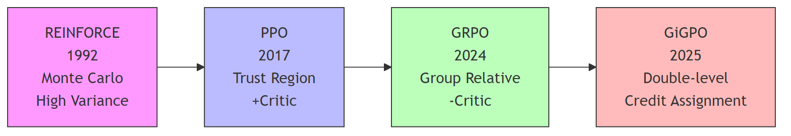

+++
date = '2026-03-12'
draft = false
title = 'From REINFORCE to GiGPO : The Evolution of Policy Gradient Methods'
author = 'lensit'
tags = ['study','rl', 'agentic-rl']
showtoc = true
showrightsidebar = true
rightSidebarWidgets = ["profile", "tags", "meta"]
sidebarAuthor = "lineance"
sidebarBio = "Happy Learning"
sidebarAvatar = "/img/avatar_study.webp"
math = true
+++

> The Bias-Variance Tradeoff and Architecture Simplification in LLM Training

---

## 1. Historical Trajectory

**Core Tension**: Unbiased high-variance Monte Carlo → Biased low-variance bootstrapping → Critic-free relative estimation → Fine-grained credit decomposition

---

## 2. REINFORCE: The Monte Carlo Foundation

**Problem**: Direct policy gradient via likelihood ratio suffers from extreme variance.

$$
\nabla_\theta J = \operatorname{E}_{\pi_\theta}\left[\sum_{t} G_t \nabla_\theta \log \pi_\theta(a_t \mid s_t)\right]
$$

**Challenge**: $G_t = \sum_{k=t}^T \gamma^{k-t}r_k$ has variance $O(T)$. Unstable for long episodes.

**Solution Attempt**: Baseline subtraction $G_t - b(s_t)$, where $b(s_t) \approx V^{\pi}(s)$.

- Reduces variance but introduces the need for value approximation, transitioning toward Actor-Critic.

**Insight**: The first principle—*direct optimization without value approximation*—remains theoretically pure but practically constrained by sample efficiency and high variance.

**Improved Version**:

- REINFORCE++: Stabilizing Critic-Free Policy Optimization with Global Advantage Normalization arXiv:2501.03262

---

## 3. [[A2C (Advantage Actor-Critic)]] : Bridging Monte Carlo and Bootstrapping

**Position**: Synchronous Actor-Critic architecture that bridges REINFORCE's Monte Carlo methods and PPO's advanced optimization.

**Core Mechanism**:

- **Actor**: Policy network $\pi_\theta(a|s)$ generating actions
- **Critic**: Value network $V_\phi(s)$ estimating state values to reduce variance

**Advantage Estimation**:
$$\hat{A}_t = \sum_{k=0}^{n-1}\gamma^k r_{t+k} + \gamma^n V_\phi(s_{t+n}) - V_\phi(s_t)$$

**Key Improvements over REINFORCE**:

- **Bootstrapping**: n-step TD replaces full Monte Carlo returns, enabling online updates without waiting for episode termination
- **Variance Reduction**: Using $V(s)$ as baseline provides lower variance than REINFORCE's simple mean baseline
- **Shared Architecture**: Feature extraction layers shared between Actor and Critic improve sample efficiency

**Evolutionary Role**: Establishes the Actor-Critic paradigm (shared parameters, advantage estimation) that becomes standard in PPO and subsequent methods.

---

## 4. [[PPO (Proximal Policy Optimization)]] : Trust Region via First-Order Approximation

**Problem**: REINFORCE requires fresh samples (on-policy). TRPO provides monotonic improvement but uses expensive second-order Fisher information. A2C lacks explicit constraints on policy updates.

**Solution**: Clipped surrogate objective achieving soft trust region:
$$\mathcal{L}^{CLIP}(\theta) = \mathbb{E}_t\left[\min\left(\rho_t(\theta)\hat{A}_t, \text{clip}(\rho_t, 1-\epsilon, 1+\epsilon)\hat{A}_t\right)\right]$$

**Key Innovation**: Importance sampling ($\rho_t = \pi_\theta/\pi_{\theta_{old}}$) enables data reuse (multiple epochs), while clipping prevents destructive policy updates.

**Cost**: Requires Critic network $V_\phi(s)$ for advantage estimation. Memory and computation overhead scales with model size, becoming prohibitive for LLMs.

---

## 5. [[PPO for LLM Post-Training (RLHF)]] : RLHF Architecture

**Paradigm Shift**: From traditional RL (pixel/vector states, environment rewards) to LLM post-training (text sequences, reward models, KL constraints).

**Four-Component Architecture**:

1. **Actor**: LLM generating tokens $\pi_\theta(t|c)$
2. **Reward Model (RM)**: Frozen preference model providing scalar rewards
3. **Reference Model (Ref)**: Frozen SFT checkpoint for KL divergence anchoring
4. **Critic**: Value network estimating state values for GAE

**LLM-Specific Adaptations**:

- **Sparse Rewards**: Only EOS token receives RM score; intermediate tokens receive KL penalty only
- **Per-Token KL Penalty**: $r_t^{\text{total}} = r_t - \beta \log\frac{\pi_\theta}{\pi_{\text{ref}}}$
- **Length Handling**: Variable sequence lengths with padding masks and response truncation

**Challenges**: 4x model memory overhead (Actor+Critic+RM+Ref), reward hacking, length bias, training instability requiring gradient clipping and adaptive KL.

**Improved Version**:

- Back to Basics: Revisiting REINFORCE Style Optimization for Learning from Human Feedback in LLMs arXiv:2402.14740

---

## An apparent digression - [[DPO (Direct Preference Optimization)]] : Offline Preference Optimization via Implicit Reward Modeling

**Problem**: PPO-LLM architecture requires four concurrent models (Actor, Critic, Reward Model, Reference), incurring prohibitive memory overhead and training instability (reward hacking, length bias).

**Theoretical Foundation**: Under the Bradley-Terry preference model $P(y_w \succ y_l | x) = \sigma(r(x,y_w) - r(x,y_l))$, the optimal policy $\pi^*$ possesses a closed-form solution:
$$\pi^*(y|x) = \frac{1}{Z(x)} \pi_{\text{ref}}(y|x) \exp\left(\frac{1}{\beta}r(x,y)\right)$$

**Reparameterization Trick**: Eliminating explicit reward modeling by expressing $r$ via policy ratios:
$$r_{\text{DPO}}(x,y) = \beta \log\frac{\pi_\theta(y|x)}{\pi_{\text{ref}}(y|x)}$$

**Loss Function** (negative log-likelihood of preference distribution):
$$\mathcal{L}_{\text{DPO}}(\theta) = -\mathbb{E}_{(x,y_w,y_l)\sim\mathcal{D}}\left[\log\sigma\left(\beta \log\frac{\pi_\theta(y_w|x)}{\pi_{\text{ref}}(y_w|x)} - \beta \log\frac{\pi_\theta(y_l|x)}{\pi_{\text{ref}}(y_l|x)}\right)\right]$$

**Evolutionary Significance**: DPO eliminates the Critic network and explicit reward modeling, foreshadowing GRPO's critic-free paradigm. It shifts the optimization from online credit assignment to offline preference classification, establishing the foundational pattern of replacing learned components with algorithmic mechanisms (closed-form reparameterization) to achieve scalability in large model alignment.

**Improved Version**:

- Why DPO is a Misspecified Estimator and How to Fix It arXiv:2510.20413

---

## 6. [[GRPO (Group Relative Policy Optimization)]] : Eliminating the Critic via Group Relativity

**Problem**: In LLM reasoning, training a Critic at scale (7B/70B parameters) is prohibitive. Dense reward signals are unavailable; only final outcomes (0/1) are verifiable.

**Solution**: Replace $V(s)$ with group statistics. For query $q$, sample $G$ outputs $\{o_1,...,o_G\}$:
$$A_i = \frac{r_i - \mu}{\sigma + \epsilon}, \quad \mu = \frac{1}{G}\sum_{j=1}^G r_j$$

**Mechanism**: Z-score normalization within group provides relative quality signal without parameter learning. All tokens in response $o_i$ share advantage $A_i$.

**Connection**: Returns to REINFORCE's Critic-free spirit, but stabilizes via cross-sample comparison rather than baseline subtraction. Eliminates the Critic network entirely, reducing memory from 3× to 2× (Actor+Ref only).

**Improved Version**:

- Uncalibrated Reasoning: GRPO Induces Overconfidence for Stochastic Outcomes arXiv:2508.11800
- Group Sequence Policy Optimization arXiv:2507.18071

---

## 7. GiGPO Part 1: Problem and Insight

**Problem**: GRPO assigns uniform credit to all tokens in a trajectory (trajectory-level advantage). In multi-step agents (50+ steps, sparse rewards), early actions causing late failures receive no specific penalty, leading to poor credit assignment in long-horizon tasks.

**Key Insight**: In multi-trajectory rollouts from the same initial state, different trajectories **revisit identical environment states** (e.g., same webpage, same room). These shared states serve as "anchor points" for fine-grained comparison without additional rollouts.

**Level 1 (Episode-Level)**:
$$A^E(\tau_i) = \frac{R(\tau_i) - \mu_{\text{episodes}}}{F_{\text{norm}}}$$
Provides stable long-term signal encouraging coherent trajectory behavior.

---

## 8. GiGPO Part 2: Step-Level Decomposition

**Level 2 (Step-Level)**: For anchor states $\tilde{s}$ visited by multiple trajectories, aggregate actions and returns:
$$G^S(\tilde{s}) = \{(a_t^{(i)}, R_t^{(i)}) \mid s_t^{(i)} = \tilde{s}\}$$

**Micro-Advantage Calculation**:
$$A^S(a_t^{(i)}) = \frac{R_t^{(i)} - \text{mean}\{R_t^{(j)} \in G^S(\tilde{s})\}}{F_{\text{norm}}}$$

**Combined Advantage**:
$$A(a_t) = A^E(\tau) + \omega \cdot A^S(a_t)$$

**Algorithmic Properties**:

- **No Additional Cost**: Requires no Critic network, no extra rollouts (0.01s/iteration overhead)
- **Dynamic Grouping**: Group sizes evolve from large (early training, agents stuck in loops) to concentrated (late training, stable strategies)
- **Graceful Degradation**: Without repeated states ($A^S=0$), automatically reduces to GRPO

**Results**: ALFWorld (+13.3% over GRPO), WebShop (+10.6%), Search-Augmented QA (3B model surpasses Search-R1).

**Related work**:

- SPA-RL: Reinforcing LLM Agents via Stepwise Progress Attribution arXiv:2505.20732
- Information Gain-based Policy Optimization: A Simple and Effective Approach for Multi-Turn LLM Agents arXiv:2510.14967

---

## 9. Comparative Analysis: Evolutionary Tradeoffs

| Method        | Variance Control      | Architecture                                   | Key Tradeoff                          | Dominant Use Case              |
| ------------- | --------------------- | ---------------------------------------------- | ------------------------------------- | ------------------------------ |
| **REINFORCE** | Baseline only         | $\pi_\theta$ only                              | Unbiased but $O(T)$ variance          | Simple control, theory         |
| **A2C**       | n-step TD/GAE         | $\pi_\theta + V_\phi$                          | Online updates, still needs Critic    | Standard RL tasks              |
| **PPO**       | Clipping + GAE        | $\pi_\theta + V_\phi$                          | Stability via Critic overhead         | General RL, continuous control |
| **PPO-LLM**   | Clipping + KL         | $\pi_\theta + V_\phi + \text{RM} + \text{Ref}$ | 4× memory, reward hacking risk        | RLHF alignment                 |
| **GRPO**      | Group relativity      | $\pi_\theta + \text{Ref}$                      | Coarse credit, no process supervision | Single-turn reasoning          |
| **GiGPO**     | Double-level grouping | $\pi_\theta + \text{Ref}$                      | State-matching dependency             | Multi-turn agent tasks         |

**Why GRPO/GiGPO over similar RLOO?**: DeepSeek-R1 demonstrated scalability. The group-relative principle existed, but the marriage with verifiable rewards and specific architectural optimizations made these methods visible.

---

## 10. Core Principles and Connections

### Axis 1: Sample Efficiency vs. Implementation Complexity

- **REINFORCE → A2C/PPO**: Importance sampling and bootstrapping enable off-policy data reuse, but introduce Critic networks and multi-epoch training complexity
- **PPO → GRPO**: Eliminates $V_\phi$ by shifting from *temporal* bootstrapping (TD) to *ensemble* comparison (group statistics), exploiting verifiable rewards in LLM reasoning without value approximation

### Axis 2: Granularity of Credit Assignment

- **Trajectory-level (GRPO)**: Uniform advantage $A_i$ assigned to all tokens; stable but coarse for long-horizon tasks with sparse rewards
- **Step-level (GiGPO)**: Fine-grained advantage $A^S(a_t)$ via state recurrence; achieves fine-grained credit without additional rollouts
- **Token-level (PPO-LLM)**: Per-token value estimation provides maximum granularity but requires prohibitive memory overhead for large models

### Axis 3: Statistical Bias vs. Variance Reduction

- **Unbiased Estimators**: REINFORCE and RLOO maintain theoretical convergence via pure Monte Carlo; suffer from $O(T)$ variance in long episodes
- **Biased Estimators**: GRPO/GiGPO introduce bias through finite-group normalization ($\mu, \sigma$ over $G$ samples) but achieve orders-of-magnitude variance reduction, enabling practical training at scale
- **Tradeoff Principle**: In high-dimensional LLM action spaces, controlled bias from ensemble estimation is preferable to variance-induced instability from sparse returns

### Axis 4: Memory Footprint vs. Sample Multiplicity

- **Architecture Efficiency**: PPO-LLM requires 4× model memory (Actor+Critic+RM+Ref); GRPO/GiGPO reduces to 2× (Actor+Ref only)
- **Sample Overhead**: Critic-free methods require $G$ rollouts per query ($G \geq 4$ typically) to estimate group statistics; trade memory for parallel sampling
- **Computational Neutrality**: GiGPO's state-matching adds 0.01s/iteration overhead despite fine-grained decomposition, preserving training throughput

### The Critic Elimination Pattern

When function approximation becomes prohibitively expensive (7B+ parameters), algorithmic mechanisms replace learned components:

$$\text{Learned Critic } V_\phi(s) \xrightarrow{\text{Group Statistics}} \frac{1}{G}\sum_{j=1}^G R(\tau_j)$$

$$\text{Temporal Bootstrapping (TD)} \xrightarrow{\text{State Recurrence}} \text{Cross-trajectory comparison}$$

**Evolutionary Pendulum**:
REINFORCE (no Critic) $\rightarrow$ Actor-Critic (Critic required) $\rightarrow$ GRPO/GiGPO (Critic eliminated via algorithmic design)

**Persistent Pattern**: As model scale increases, learned value networks are progressively replaced by computational mechanisms (group comparison, clipping, state-anchoring) to maintain scalability while preserving optimization stability.

---

## 11. Questions

- Latent Information Exploitation.
- Test Time Scaling / Training.
- Step level gradient update.
- Multi-Turn Temporal composition Flow-GRPO (AgentFlow)
- Turn-level abstraction (MDP compression)
- clipping : Clip-Higher (DAPO) ,CISPO (Clipped IS-weight Policy Optimization),RSPO (Router-Shift Policy Optimization) 

---

## Thank You and Further Read

- REINFORCE++: Stabilizing Critic-Free Policy Optimization with Global Advantage Normalization arXiv:2501.03262
- Why DPO is a Misspecified Estimator and How to Fix It arXiv:2510.20413 
- Uncalibrated Reasoning: GRPO Induces Overconfidence for Stochastic Outcomes  	arXiv:2508.11800
- Back to Basics: Revisiting REINFORCE Style Optimization for Learning from Human Feedback in LLMs arXiv:2402.14740
- DAPO: An Open-Source LLM Reinforcement Learning System at Scale arXiv:2503.14476
- Group Sequence Policy Optimization arXiv:2507.18071 
- SPA-RL: Reinforcing LLM Agents via Stepwise Progress Attribution arXiv:2505.20732
- [[Information Gain-based Policy Optimization - A Simple and Effective Approach for Multi-Turn LLM Agents]]arXiv:2510.14967
- EvoTest: Evolutionary Test-Time Learning for Self-Improving Agentic Systems
- Heuristics-Considered-Harmful-RL-With-Random-Rewards-Should-Not-Make-LLMs-Reason

> P.S. From a simple presentation slide made by marp in early learing stage, feel sorry for mistakes and misunderstanding